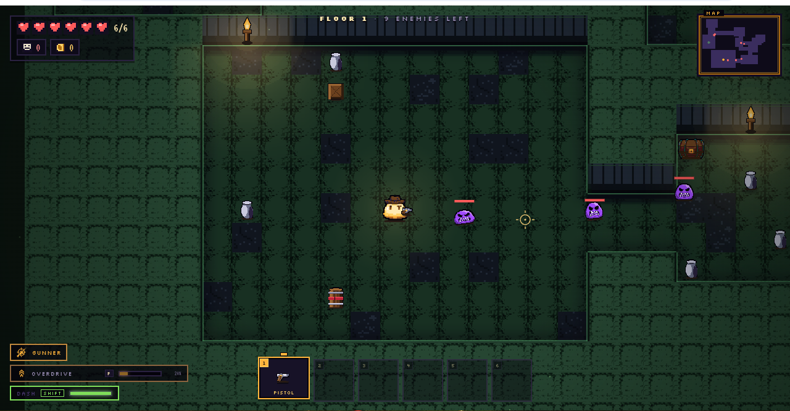
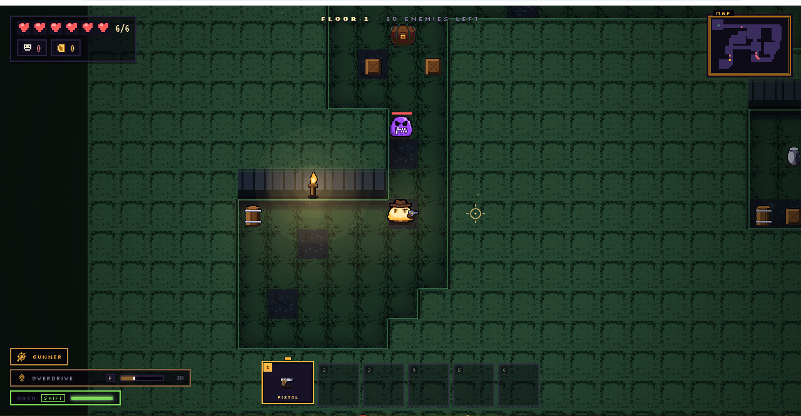

# blobrogue

A cozy little top-down roguelike shooter you play right in the browser. You're an
amber cowboy-blob blasting through procedurally generated depths — solo, or in
real-time co-op with friends. Inspired by Soul Knight.

**▶ Play:** https://blobrogue.vercel.app

  
  

## Controls
| | |
|---|---|
| **WASD / Arrows** | move |
| **Mouse** | aim |
| **Click / hold** | shoot |
| **Shift** | dash (brief i-frames) |
| **F** | kit ultimate (when charged) |
| **E** | interact / shop · **hold** to revive a downed teammate |
| **Tab** (hold) | run + all-time stats |
| **Esc** | pause + settings |

Clear a floor, step into the glowing exit to descend, and see how deep you can get.

## What's in it
- **4 kits, 4 playstyles** — Gunner (DPS), Mender (healer), Bulwark (tank), Phantom
  (mobility), each with a signature ultimate.
- **Deep loadouts** — 49 weapons and 45+ blessings that stack into wild builds. No two
  runs play the same.
- **Real bosses** — a hand-authored boss every 5 floors, each with its own telegraphed
  signature attack and counterplay (not just a bullet-sponge).
- **Online co-op** — quick-play or share a 4-letter room code. Everyone lands in the same
  authoritative server world, with a 25s reconnect grace so a Wi-Fi blip is never a death.
- **Juice** — hit-stop, screen shake, particles, muzzle flash, and a fully **procedural
  WebAudio** soundtrack + SFX (zero audio files).
- **Pixel art, all generated** — every sprite runs through a custom art pipeline.

## Stack
Vite + TypeScript on a raw HTML5 canvas (no engine). Real-time multiplayer, accounts, and
saved stats via [Convex](https://convex.dev); deployed on Vercel; authoritative game server
in [`server/`](server/README.md).

---

<b>Architecture & deployment (for devs)</b>

### Multiplayer
Co-op, logins, and saved data are powered by Convex and are **opt-in** via a single env var
(`VITE_CONVEX_URL`). With it unset, the game runs exactly like solo v0. Full provisioning
steps and architecture: **[MULTIPLAYER.md](MULTIPLAYER.md)**.

### Authoritative game server (Stage C) + rooms
A real **authoritative WebSocket server** runs the same `src/sim/stepWorld` as the single
source of truth; clients send inputs and predict/reconcile. It lives in
**[`server/`](server/README.md)**; each room code binds to its own isolated server world via
a Convex-minted, server-verified ticket. Solo stays on the in-process `LocalTransport`,
byte-identical. Measured reports:
**[Stage C](docs/blobrogue_STAGE_C_report.md)** · **[Stage B](docs/blobrogue_STAGE_B_report.md)**.

### Deployment / control plane
Production deploys, restarts, drains, and rollbacks run through an isolated, loopback-only
control service — **[`control/`](control/README.md)** — driving an immutable release pipeline
(atomic `current` symlink) with full audit. Spec:
**[control-plane spec](docs/specs/blobrogue_POST_SERVER_CONTROL_PLANE_spec.md)**.

Built and maintained autonomously. Evolves every few hours.
